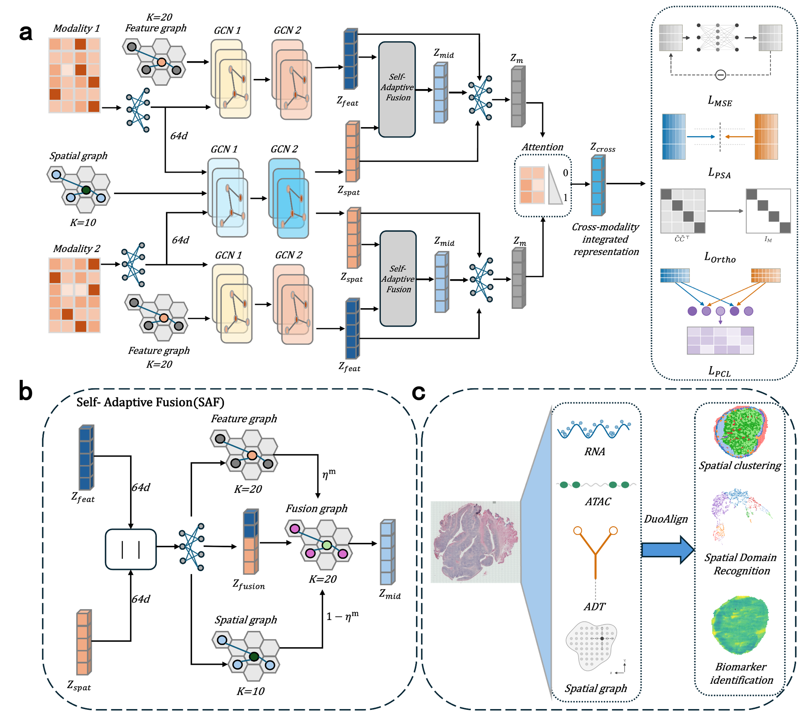

# Overview
This is the official repository for DuoAlign, which is used to identify spatial domains from spatial multi-omics data, particularly for cases where discrete distributed spots belong to the same spatial domain, such as scattered follicles and T-cell zones, and for adjacent structures whose molecular profiles are similar, such as the capsule, cortex and pericapsular adipose tissue. Our code is based on the paper "DuoAlign: duo-view hierarchical alignment for spatial multi-omics integration."



## Requirements
You'll need to install the following packages in order to run the codes.
* python==3.8
* torch>=2.0.0
* cudnn>=10.2
* numpy
* scanpy==1.9.3
* anndata
* pandas
* scipy
* scikit-learn
* scikit-misc
* seaborn
* umap-learn
* matplotlib

`scikit-misc` is required by `scanpy.pp.highly_variable_genes(flavor='seurat_v3')`, which is used for
gene selection. `seaborn` and `umap-learn` are only needed for the attention violin plot and the UMAP
figure. `rpy2` and `R` are required only if you call the optional `mclust_R` helper in
`DuoAlign/utils.py`; the default pipeline clusters with KMeans and does not need them.


## Tutorial
For the step-by-step tutorial, please refer to:
[DuoAlign/notebooks/](notebooks/)

Seven notebooks are provided, one for each annotated dataset used in the paper (human lymph node A1,
D1 and slice2; mouse E15 and E18 brain; mouse spleen; human placenta). Each notebook is organised as
one code cell per step — environment, imports, hyper-parameters, data loading, preprocessing, graph
construction, training, clustering metrics, spatial clustering map, cross-modal attention violin plot
and UMAP — and writes its figures to `notebooks/figs/`.

To execute a notebook from the command line:

```bash
cd DuoAlign/notebooks
jupyter nbconvert --to notebook --execute --output 06_Mouse_Spleen_RUN.ipynb \
  --ExecutePreprocessor.timeout=1800 06_Mouse_Spleen.ipynb
```

The same pipeline is also available as plain scripts under `DuoAlign/run_scripts/`.


## Benchmarking
In this study, we conducted benchmarking of DuoAlign against the latest methods—STAGATE, GraphST,
SpatialGlue, PRAGA, SpaMV, SSGATE and spaVAE—using different tests with default parameters. STAGATE
and GraphST are single-omics spatial domain identification methods, while SpatialGlue, PRAGA, SpaMV,
SSGATE and spaVAE are spatial multi-omics methods. All methods share the same data preprocessing and
the same clustering protocol (KMeans with `n_init = 20` and `random_state = 2022`, with the number of
clusters set to the ground-truth class number); graph construction follows each method's own default
setting.

DuoAlign is evaluated on seven annotated datasets covering four platforms and two omics combinations
(transcriptome + surface protein, transcriptome + chromatin accessibility), and is further applied to
an unannotated human breast cancer FFPE specimen profiled by spatial multi-omics, where no ground
truth is available. We report ARI, FMI and Completeness. With `random_state = 2022`, the released code
reproduces the reported values exactly, for example ARI 0.3112 / FMI 0.4743 / Completeness 0.4253 on
the lymph node A1 section, ARI 0.5577 / FMI 0.6293 / Completeness 0.5594 on the mouse E15 brain, and
ARI 0.1878 / FMI 0.5025 / Completeness 0.1908 on the mouse spleen.
